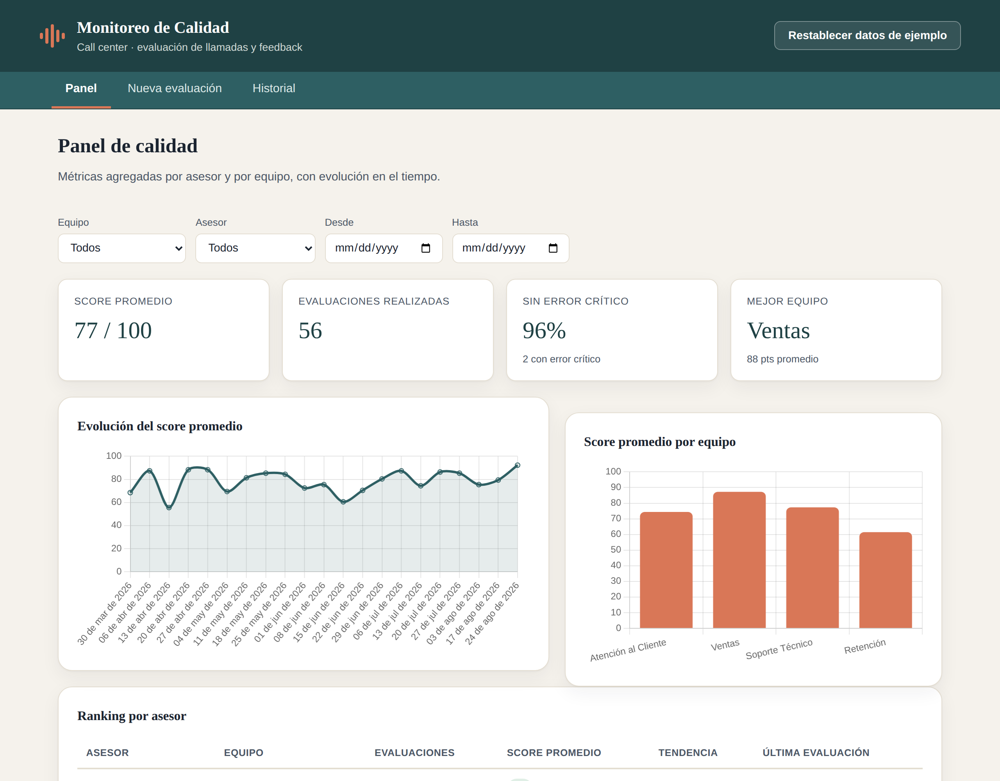
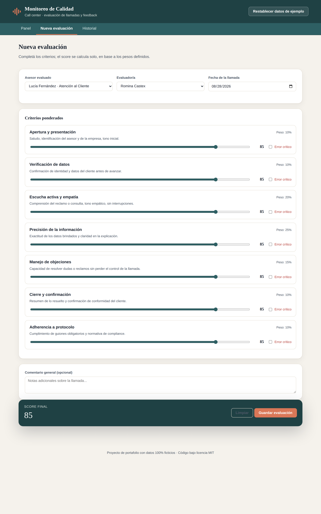
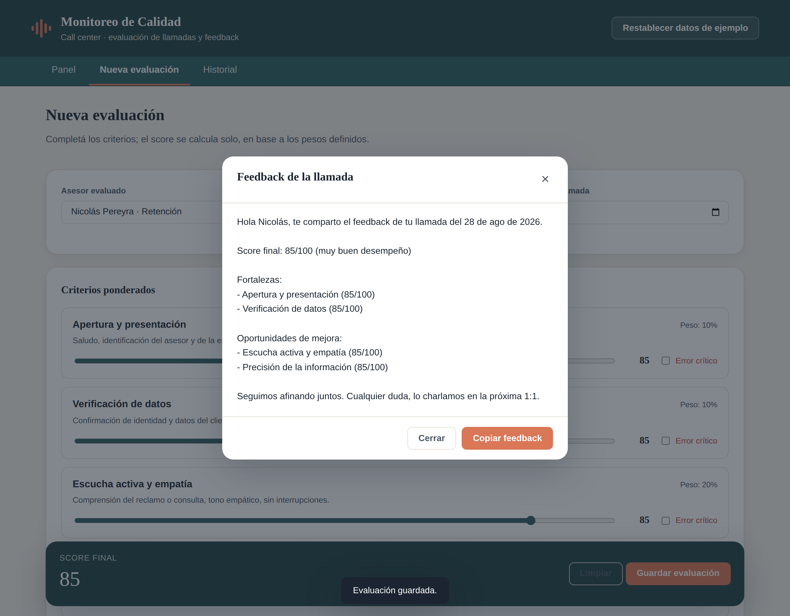
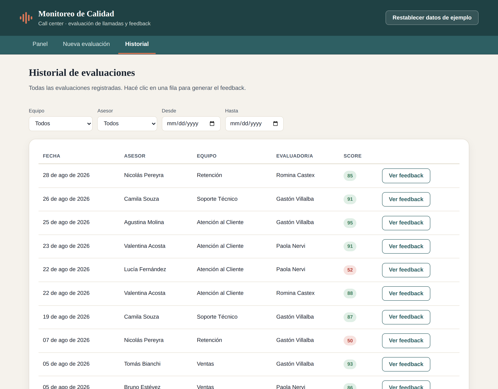

# Monitoreo de Calidad · Call Center

App web para evaluar llamadas de un call center, ver métricas de calidad por
asesor y por equipo, y generar feedback listo para compartir. Corre 100% en
el navegador, sin backend ni build: se abre `index.html` y funciona.

**Demo:** https://tapiceriamiguelangel-eclat.github.io/monitoreo-calidad-callcenter/

> Proyecto de portafolio. Todos los nombres, equipos y evaluaciones son
> datos ficticios generados para la demo.



## Qué problema resuelve

En un call center, monitorear la calidad de las llamadas suele terminar en
una planilla suelta: cada evaluador pondera los criterios a su manera, el
feedback se redacta desde cero cada vez, y ver la evolución de un asesor en
el tiempo implica armar un gráfico a mano. Esta app junta las tres cosas en
un mismo lugar:

- **Evaluación con criterios ponderados**: se completa un formulario por
  llamada y el score sale solo, calculado con los mismos pesos siempre.
- **Panel de métricas**: score promedio, evolución en el tiempo y ranking
  por asesor y por equipo, con filtros.
- **Feedback generado**: a partir de la evaluación, arma un texto con
  fortalezas y oportunidades de mejora, listo para copiar y enviar.

## Cómo funciona

### 1. Nueva evaluación

Se elige el asesor, el evaluador y la fecha de la llamada, y se completa
cada criterio con un slider (0 a 100). El score final se recalcula en vivo
con los pesos de cada criterio. Si un criterio se marca como **error
crítico**, el score final pasa a 0 sin importar el resto de los puntajes,
siguiendo la lógica habitual de monitoreo de calidad en call centers
(hay incumplimientos, como no verificar identidad, que invalidan la llamada
entera más allá de cómo haya sido el resto).



Al guardar, la evaluación queda persistida y se abre automáticamente el
modal de feedback.

### 2. Feedback

El texto se arma solo a partir de la evaluación: saluda al asesor por su
nombre, muestra el score y su interpretación, lista las 2 fortalezas mejor
puntuadas y las 2 oportunidades de mejora peor puntuadas (sin repetir
criterios entre ambas listas), avisa si hubo un error crítico, e incluye el
comentario del evaluador si lo hay. Un botón lo copia al portapapeles.



### 3. Panel

Métricas agregadas con filtro por equipo, asesor y rango de fechas: score
promedio, cantidad de evaluaciones, porcentaje sin errores críticos, mejor
equipo, evolución del score en el tiempo y ranking por asesor con
tendencia.

### 4. Historial

Todas las evaluaciones registradas, filtrables, con acceso directo al
feedback de cada una.



### Datos de ejemplo

La app arranca con datos ficticios precargados desde `data/seed.json` (4
equipos, 12 asesores, 7 criterios y ~56 evaluaciones simuladas), para que
se vea funcionando desde el primer segundo. Todo lo que se agrega después
se guarda en `localStorage` del navegador. El botón **"Restablecer datos de
ejemplo"** del header borra lo guardado y vuelve a cargar el seed original.

## Decisiones técnicas

- **HTML, CSS y JS vanilla, sin build.** El único requisito es abrir
  `index.html`. Los módulos usan el patrón IIFE (`const Panel = (function
  () {...})()`) en lugar de ES modules para evitar restricciones de CORS
  al abrir el archivo directo desde el disco.

- **`fetch` de `seed.json` con fallback embebido.** Chrome bloquea el
  `fetch` de archivos locales cuando se abre `index.html` con doble clic
  (protocolo `file://`), por política de CORS. `js/datos.js` intenta el
  fetch primero —que funciona sin problema una vez publicado en GitHub
  Pages— y si falla, usa `js/seed-fallback.js`, una copia idéntica de los
  mismos datos embebida como constante de JavaScript. Así la demo funciona
  igual de bien publicada que abierta directo desde el disco.

- **Arranque resiliente.** La navegación entre pestañas y el botón de
  restablecer se activan antes de cargar los datos y los gráficos, y cada
  vista se inicializa en su propio `try/catch`. Si algo falla más abajo
  (por ejemplo, la librería de gráficos no llega a cargar por un problema
  de red), la app sigue siendo usable en vez de quedar rota por completo.
  El panel además detecta si `Chart.js` no está disponible y muestra un
  aviso en lugar del gráfico, sin romper el resto de la vista.

- **Copiado con fallback.** El botón "Copiar feedback" usa
  `navigator.clipboard.writeText`, que requiere un contexto seguro
  (HTTPS o `localhost`). Si no está disponible, cae a un `textarea`
  temporal con `document.execCommand("copy")`.

- **Cero expresiones regulares.** Todo el parseo de texto y fechas se
  resuelve con `split`, `includes`, `startsWith`, `Number()` e
  `Intl.DateTimeFormat`, sin usar `RegExp` en ningún archivo.

- **Persistencia simple.** Un único objeto en `localStorage`, bajo una
  clave versionada (`mcc:datos:v1`), con todo el estado de la app
  (asesores, equipos, criterios, evaluadores y evaluaciones).

- **Cero dependencias externas en runtime.** Chart.js está vendorizado en
  `js/vendor/chart.umd.min.js` en lugar de cargarse desde un CDN. La
  primera versión usaba `cdnjs.cloudflare.com`, pero en la práctica
  bastantes visitantes no lo cargan —bloqueadores de anuncios, extensiones
  de privacidad o proxies corporativos que filtran CDNs de scripts— y el
  panel quedaba sin gráficos por una causa totalmente ajena a la app. Para
  un portafolio, donde no controlás qué bloqueador tiene cada visitante,
  autoalojar la librería es más confiable que depender de un tercero. La
  tipografía usa una pila de fuentes del sistema (`Iowan Old Style` /
  `Palatino` / `Georgia` para títulos, sans del sistema para el resto) por
  el mismo motivo: no depender de ningún servicio externo.

## Estructura del proyecto

```
index.html          Punto de entrada (requisito de GitHub Pages)
css/
  styles.css         Paleta, tipografía y todos los componentes visuales
js/
  storage.js          Capa de localStorage
  seed-fallback.js     Copia embebida de data/seed.json
  datos.js             Carga de datos, cálculo de scores y métricas agregadas
  feedback.js          Generador de texto de feedback + modal + copiado
  evaluacion.js        Formulario de nueva evaluación
  panel.js             Dashboard: KPIs, gráficos y ranking
  historial.js         Listado filtrable de evaluaciones
  main.js              Arranque de la app y navegación entre vistas
  vendor/
    chart.umd.min.js    Chart.js autoalojado (sin dependencias en runtime)
data/
  seed.json            Datos de ejemplo (100% ficticios)
favicon.svg
```

## Correrlo localmente

No hace falta instalar nada: se puede abrir `index.html` directo en el
navegador. Para simular las mismas condiciones que GitHub Pages (con
`fetch` funcionando en vez de caer al fallback), alcanza con levantar
cualquier servidor estático desde la carpeta del proyecto, por ejemplo:

```bash
python3 -m http.server 8000
```

y entrar a `http://localhost:8000`.

## Licencia

MIT. Ver [LICENSE](LICENSE).

`js/vendor/chart.umd.min.js` es una copia sin modificar de
[Chart.js](https://www.chartjs.org) 4.4.4, también bajo licencia MIT.
